# 🧠 Mood Tracker App

A mobile app for tracking daily moods, reflecting on emotional history, and analyzing patterns over time. 
Built with **React Native**, **Expo**.

---

## ✨ Screens

- 📊 **Home Mood Overview** — quick snapshot of your current emotional state and entry access
  - 📆 **Weekly Mood** — view and interact with mood entries over a 7-day calendar period, including mood-to-mood comparison
  - 🗓️ **Monthly Mood** — visual calendar displaying daily mood entries and monthly mood distribution stats
  - 📈 **Totally Mood** — aggregate mood trends across all time with visual charts and total mood counts
- 📝 **Mood Form** — create or update a mood entry with selected mood, notes, and exact date
- 📚 **History View** — scrollable and paginated list of all entries with options to edit or delete past moods
- 🌐 **Posts API (Demo)** — example screen integrating mock post data with expandable comment sections
- ⚙️ **Settings** — simulated configuration panel with mock toggles and expandable documentation on app structure

---

## 🧩 Tech Stack

- **React Native + Expo**
- **TypeScript**

---

## 🔧 Getting Started

```bash
git clone ---
cd mood-tracker-app
npm install
npm run start
```

---

## 📸 Screenshots

| Light Mode | Dark Mode |
|------------|-----------|
| 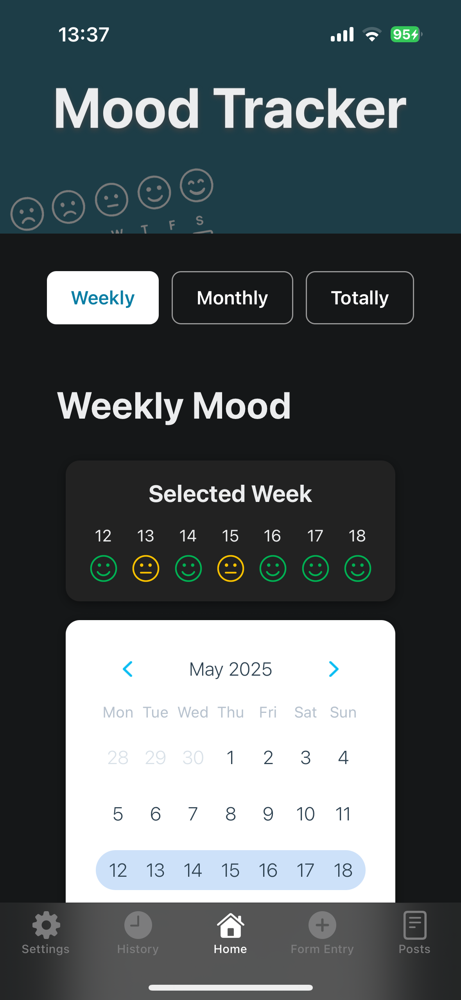 |  |
| 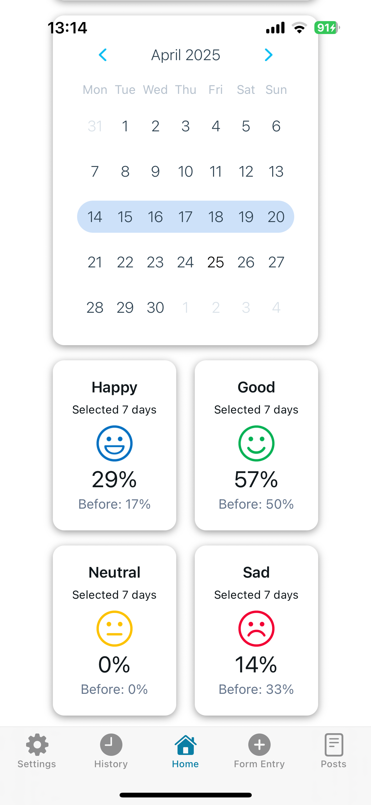 | 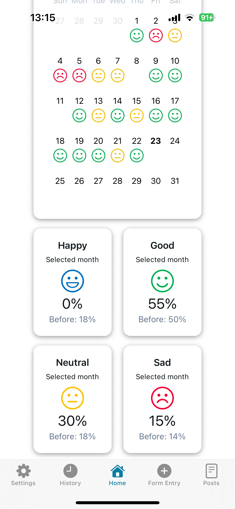 |
| 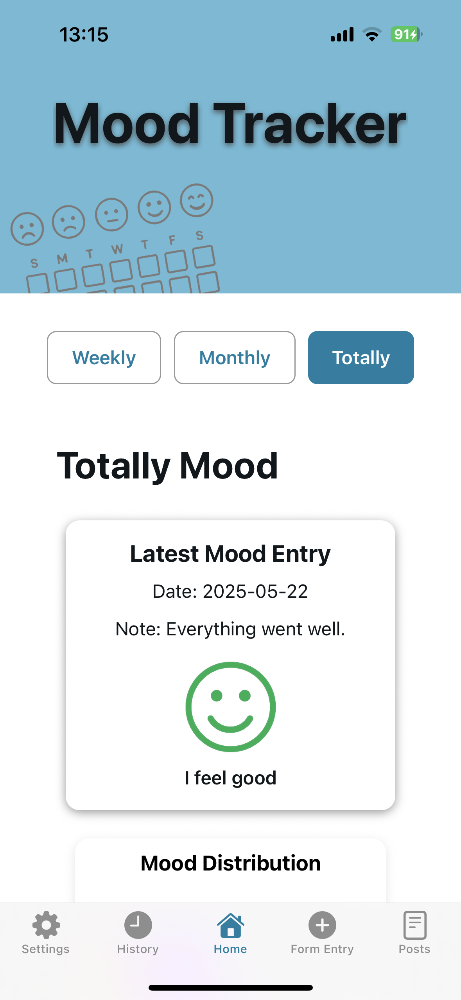 | 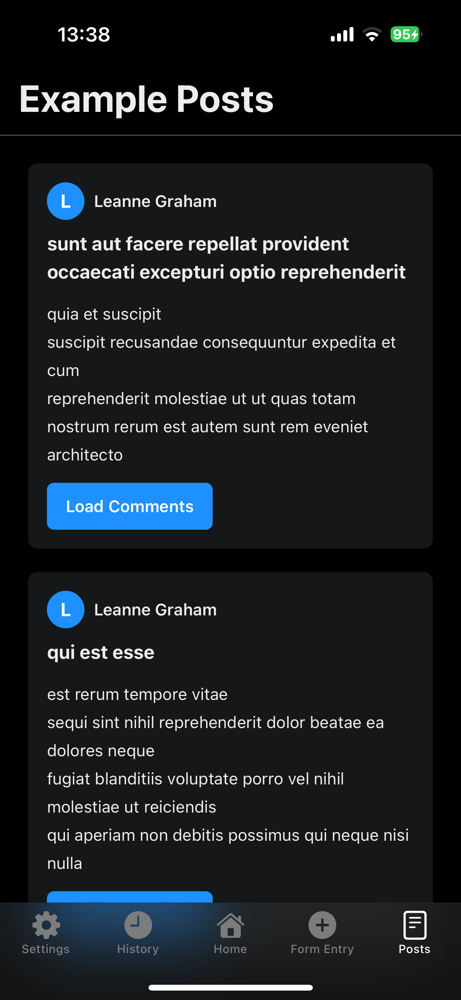 |
|  | 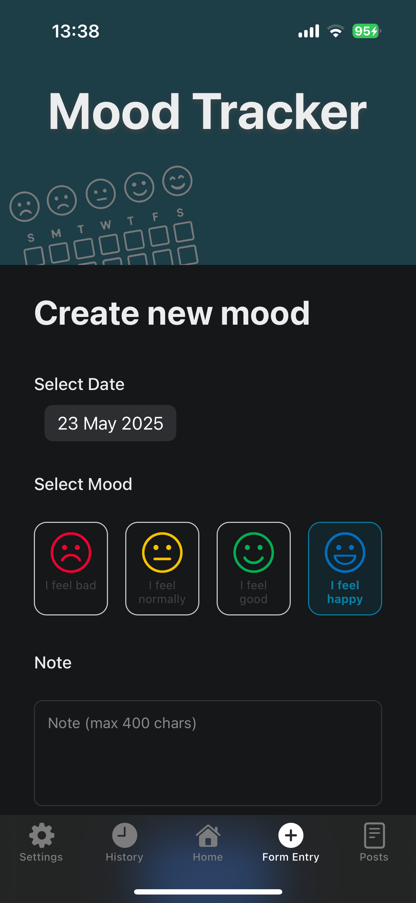 |
| 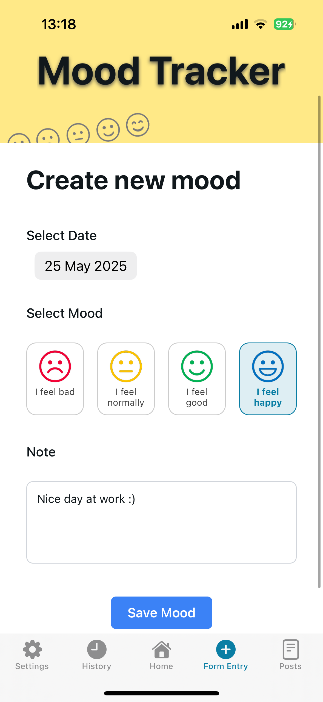 | 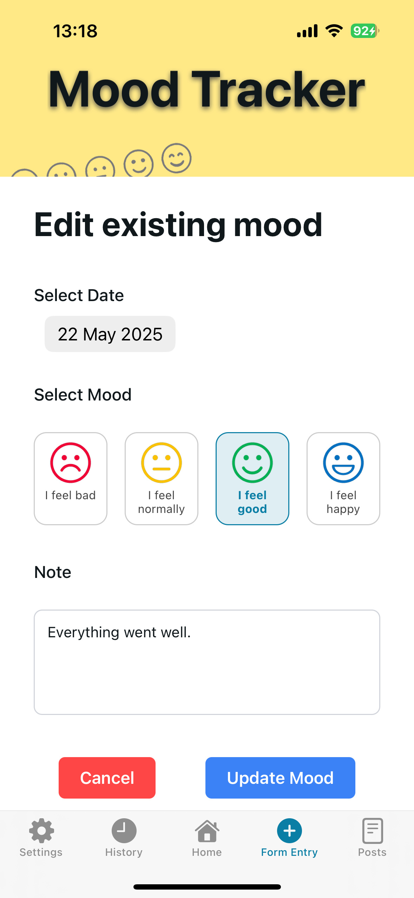 |
| 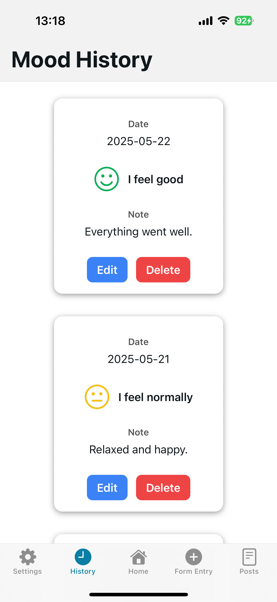 | 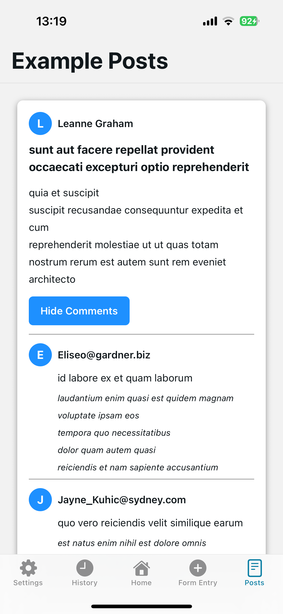 |
|  | 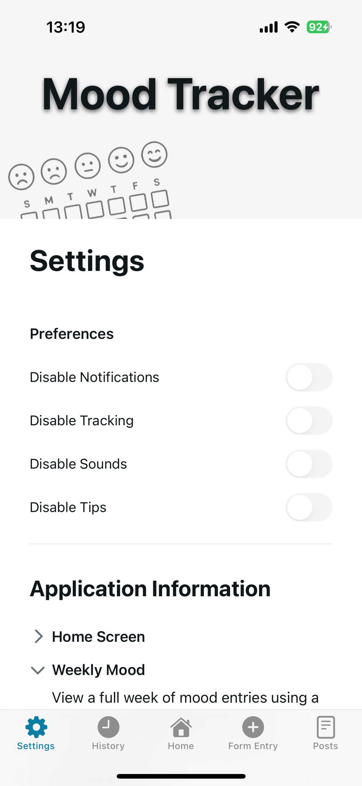 |

---